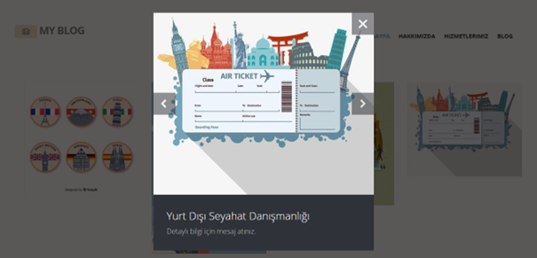
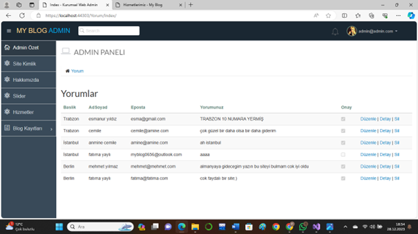

# Seyahat Blog Sitesi (2024)
Bu proje, gezilen ülke ve şehirlerdeki görülmesi gereken yerleri tanıtmak amacıyla geliştirilmiş, dinamik içerik yönetimine sahip bir web uygulamasıdır. Kullanıcılar seyahat rotaları hakkında bilgi alabilirken, yöneticiler tüm içeriği bir panel üzerinden kontrol edebilmektedir.

## Ekip Üyeleri
**Fatıma Yaylı**  
**Amine Cemile Doğru** 

## Kurum
**Sakarya Uygulamalı Bilimler Üniversitesi** Teknoloji Fakültesi, Bilgisayar Mühendisliği Bölümü 
**Ders:** Programlama 2 

## Teknik Özellikler ve Yetenekler
### Kullanıcı Arayüzü (Frontend)
**Dinamik Ana Sayfa:** Site ismi, amblemi ve güncel menü yapısı. 
**Görsel Deneyim:** Etkileyici bir slider bölümü ve hizmetleri tanıtan görsel alanlar.
**Kategorize Edilmiş İçerik:** Ülke (Türkiye, Almanya vb.) ve şehir bazlı blog yazıları.
**Etkileşim:** Kullanıcıların yazıların altına yorum yapabilme özelliği.

### Admin Paneli
**Güvenli Giriş:** E-posta ve şifre korumalı yönetim erişimi.
**İçerik Yönetimi (CRUD):** * Hakkımızda metinlerini ve hizmet açıklamalarını düzenleme.
* Slider resimlerini ve site kimlik bilgilerini güncelleme.
* Blog yazılarını ekleme, silme ve düzenleme. 
**Yorum Onay Mekanizması:** Gelen yorumlar önce panele düşer; yönetici onayından sonra yayına alınır.

## Veritabanı Yapısı
Proje, tüm içeriklerin (yazılar, yorumlar, hizmetler, kullanıcılar) dinamik olarak yönetilebilmesi için SQL tabanlı bir veritabanı yapısı kullanmaktadır.

## Ekran Görüntüleri
#### Ana Sayfa

#### Hizmetlerimiz

#### Yorum Sayfası

#### Yönetim Paneli (Özet ve İçerik)

